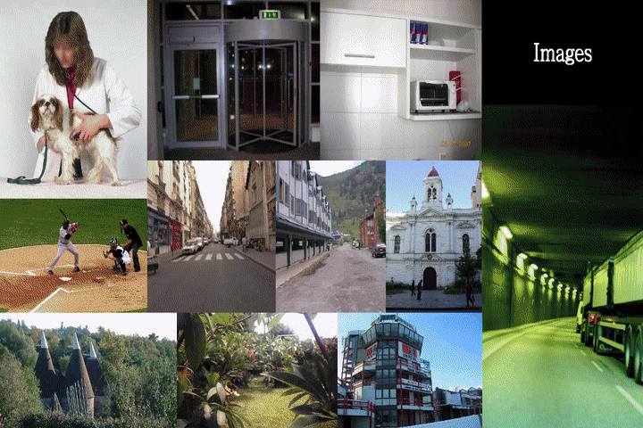
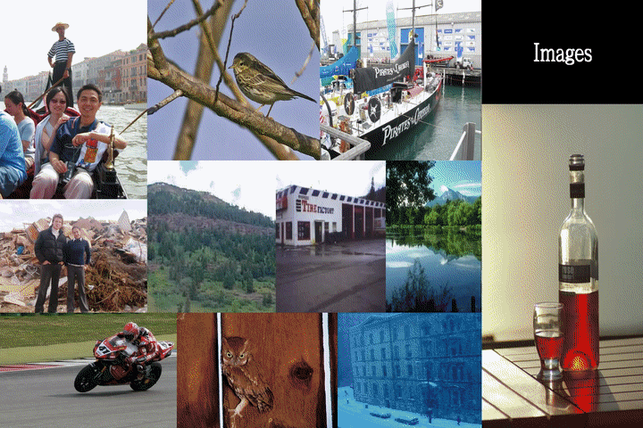
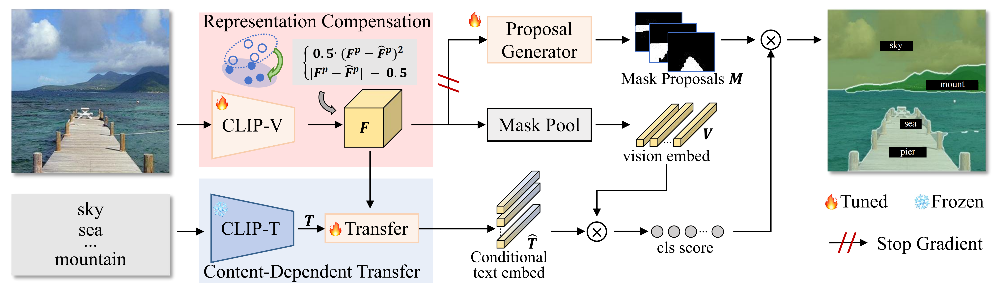

# 

<div align="center">
<h1> MAFT+ (ECCV 2024 oral) </h1>
<h3>Collaborative Vision-Text Representation Optimizing for Open-Vocabulary Segmentation</h3>

[Siyu Jiao](https://github.com/jiaosiyu1999)<sup>1,2</sup>,[Hongguang Zhu](https://github.com/KevinLight831)<sup>1,2</sup>,[Jiannan Huang](https://github.com/Rbrq03)<sup>1,3</sup>, [Yao Zhao](https://scholar.google.com/citations?user=474TbQYAAAAJ&hl=zh-CN&oi=ao)<sup>1,2</sup>, [Yunchao Wei](https://weiyc.github.io/)<sup>1,2</sup>, [Humphrey Shi](https://scholar.google.com/citations?user=WBvt5A8AAAAJ&hl=en)<sup>3,4</sup>,

<sup>1</sup> Beijing Jiaotong University, <sup>2</sup> Pengcheng Lab, <sup>3</sup> Georgia Institute of Technology, <sup>4</sup> Picsart AI Research (PAIR)


[[`Paper`](https://arxiv.org/pdf/2408.00744)] 

[](https://paperswithcode.com/sota/open-vocabulary-panoptic-segmentation-on?p=collaborative-vision-text-representation)
[](https://paperswithcode.com/sota/open-vocabulary-semantic-segmentation-on-3?p=collaborative-vision-text-representation)
[](https://paperswithcode.com/sota/open-vocabulary-semantic-segmentation-on-2?p=collaborative-vision-text-representation)
[](https://paperswithcode.com/sota/open-vocabulary-semantic-segmentation-on-7?p=collaborative-vision-text-representation)
[](https://paperswithcode.com/sota/open-vocabulary-semantic-segmentation-on-5?p=collaborative-vision-text-representation)
[](https://paperswithcode.com/sota/open-vocabulary-semantic-segmentation-on-1?p=collaborative-vision-text-representation)

</div>

<div align="center">


</div>

## Introduction

This work is an enhanced version of our NeurIPS paper [MAFT](https://arxiv.org/abs/2310.00240).   
Pre-trained vision-language models, *e.g.* CLIP, have been increasingly used to address the challenging Open-Vocabulary Segmentation (OVS) task, benefiting from their well-aligned vision-text embedding space. Typical solutions involve either freezing CLIP during training to unilaterally maintain its zero-shot capability, or fine-tuning CLIP vision encoder to achieve perceptual sensitivity to local regions.  However, few of them incorporate vision-text collaborative optimization. Based on this, we propose the [Content-Dependent Transfer](https://github.com/jiaosiyu1999/MAFT-Plus/blob/master/maft/modeling/maft/content_dependent_transfer.py) to adaptively enhance each text embedding by interacting with the input image, which presents a parameter-efficient way to optimize the text representation. Besides, we additionally introduce a [Representation Compensation](https://github.com/jiaosiyu1999/MAFT-Plus/blob/master/maft/modeling/maft/representation_compensation.py) strategy, reviewing the original CLIP-V representation as compensation to maintain the zero-shot capability of CLIP. In this way, the vision and text representation of CLIP are optimized collaboratively, enhancing the alignment of the vision-text feature space. To the best of our knowledge, we are the first to establish the collaborative vision-text optimizing mechanism within the OVS field. Extensive experiments demonstrate our method achieves superior performance on popular OVS benchmarks. In open-vocabulary semantic segmentation, our method outperforms the previous state-of-the-art approaches by +0.5, +2.3, +3.4, +0.4 and +1.1 mIoU, respectively on A-847, A-150, PC-459, PC-59 and PAS-20. Furthermore, in a panoptic setting on ADE20K, we achieve the performance of 27.1 PQ, 73.5 SQ, and 32.9 RQ.



### Installation
1. Clone the repository
    ```
    git clone https://github.com/jiaosiyu1999/MAFT_Plus.git
    ```
2. Navigate to the project directory
    ```
    cd MAFT_Plus
    ```
3. Install the dependencies
    ```
    bash install.sh
    cd maft/modeling/pixel_decoder/ops
    sh make.sh
    ```
    
<span id="2"></span>

### Data Preparation
See [MAFT](https://github.com/jiaosiyu1999/MAFT/tree/master) for reference ([Preparing Datasets for MAFT](https://github.com/jiaosiyu1999/MAFT/tree/master/datasets#readme)). The data should be organized like:
```
datasets/
  ade/
      ADEChallengeData2016/
        images/
        annotations_detectron2/
      ADE20K_2021_17_01/
        images/
        annotations_detectron2/
  coco/
        train2017/
        val2017/
        stuffthingmaps_detectron2/
  VOCdevkit/
     VOC2012/
        images_detectron2/
        annotations_ovs/      
    VOC2010/
        images/
        annotations_detectron2_ovs/
            pc59_val/
            pc459_val/      
```
<span id="3"></span>

### Usage

- #### Pretrained Weights

  1. semantic
     
  |Model|A-847| A-150| PC-459| PC-59| PAS-20 |Weights|
  |-----|--|-|-|-|--|---|
  |MAFTP-Base|13.8|34.6|16.2|57.5|95.4 |[maftp_b.pth](https://drive.google.com/file/d/1BeEeKOnWWIWIH-QWK_zLhAPUzCOnHuFG/view?usp=sharing) |
  |MAFTP-Large|15.1|36.1|21.6|59.4|96.5 |[maftp_l.pth](https://drive.google.com/file/d/1EQo5guVuKkSSZj4bv0FQN_4X9h_Rwfe5/view?usp=sharing) |
  
  2. panoptic  
     
  ||PQ| SQ| RQ|Weights|
  |-----|--|-|-|-|
  |MAFTP-Large|27.1|73.5|32.9|[maftp_l_pano.pth](https://drive.google.com/file/d/1znk_uco8fwvbA0kndy4kGyVp22KbQr6g/view?usp=sharing) |
  
- #### Evaluation 

  <span id="4"></span>
  evaluate trained model on validation sets of all datasets.
  ```
  python train_net.py --eval-only --config-file <CONFIG_FILE> --num-gpus <NUM_GPU> OUTPUT_DIR <OUTPUT_PATH> MODEL.WEIGHTS <TRAINED_MODEL_PATH>
  ```
   For example, evaluate our pre-trained ```maftp_l.pth``` model:
  ```
  # 1. Download MAFTP-Large.
  # 2. put it at `out/semantic/MAFT_Plus/maftp_l.pth`.
  # 3. evaluation
    python train_net.py --config-file configs/semantic/eval.yaml  --num-gpus 8 --eval-only \
                         MODEL.WEIGHTS out/semantic/MAFT_Plus/maftp_l.pth 
  ```
<span id="5"></span>
- #### Training

  <span id="4"></span>
  **end to end training** requires 8*A100 GPUs and 14 hours, approximately:

```
    # MAFT-Plus-Large (maftp-l)
    python train_net.py --config-file configs/semantic/train_semantic_large.yaml  --num-gpus 8

    # MAFT-Plus-Base (maftp-b)
    python train_net.py --config-file configs/semantic/train_semantic_base.yaml  --num-gpus 8
```
- #### Inference Demo with Pre-trained Models
  We provide ```demo/demo.py``` that is able to demo builtin configs. Run it with: 
  ```
  python demo/demo.py \
    --input input1.jpg input2.jpg \
    [--other-options]
    --opts MODEL.WEIGHTS /path/to/checkpoint_file
  ```
   For example, evaluate our pre-trained ```maftp_l.pth``` model:
  ```
  # 1. Download MAFTP-Large.
  # 2. put it at `out/semantic/MAFT_Plus/maftp_l.pth`.
  # 3. run demo:
    python demo/demo.py  --input im.png
  ```
  
<span id="6"></span>
### Cite 

If this codebase is useful to you, please consider citing:
```
@inproceedings{jiao2024collaborative,
  title={Collaborative Vision-Text Representation Optimizing for Open-Vocabulary Segmentation},
  author={Jiao, Siyu and Zhu, Hongguang and Huang, Jiannan and Zhao, Yao and Wei, Yunchao and Humphrey, Shi},
  booktitle={European Conference on Computer Vision},
  year={2024},
}
```

### Acknowledgement
[Mask2Former](https://github.com/facebookresearch/Mask2Former)

[FC-CLIP](https://github.com/bytedance/fc-clip)


